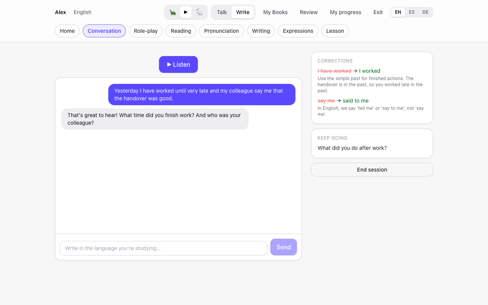
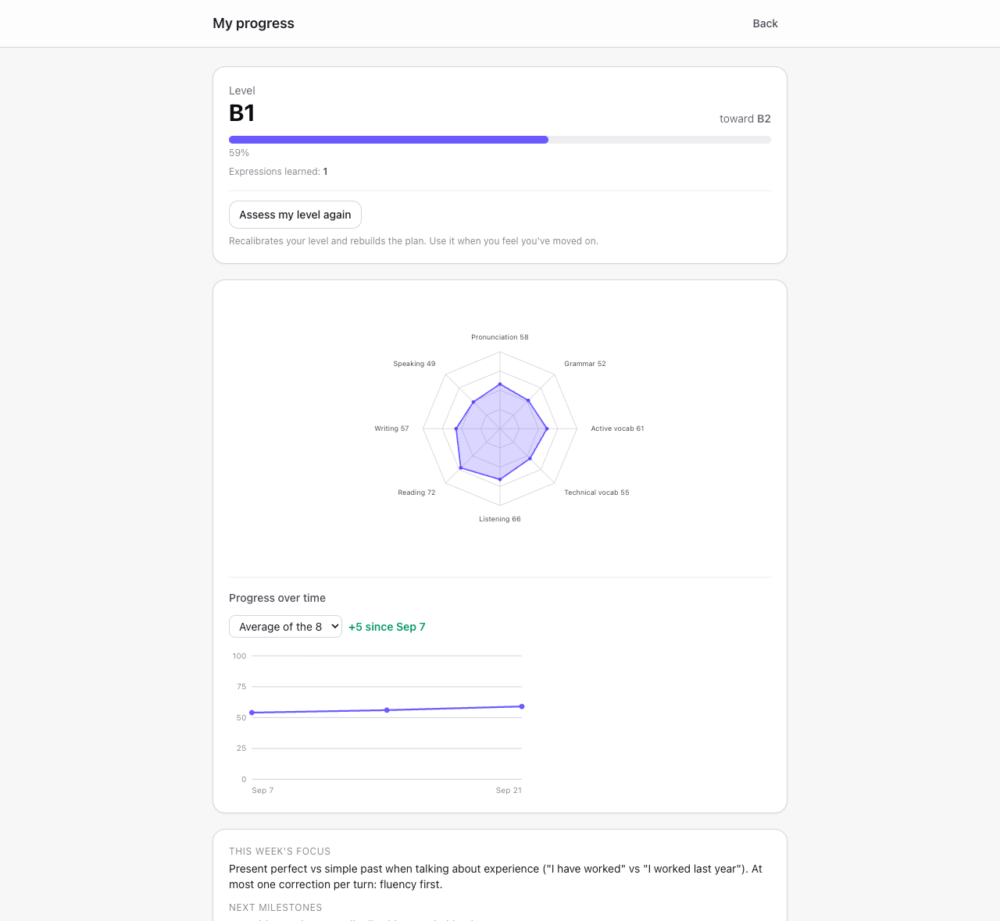
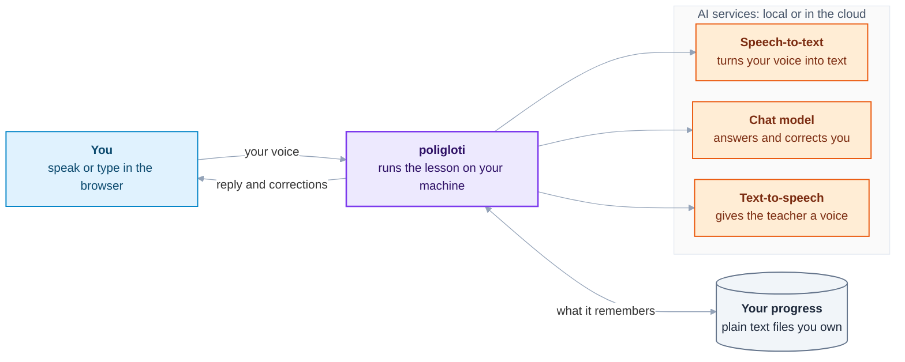

# poligloti

**poligloti** is a patient AI language teacher for speaking practice. It never judges, never gets tired, and remembers what you already know, so you can practice out loud even if speaking in front of people makes you freeze.

Local-first and private: runs on local models (Ollama, speaches, llama.cpp, LM Studio) or any OpenAI-compatible API. German, English and French.



## Why

Many people understand a language well and still freeze the moment they have to speak, because someone is listening. With poligloti you can get it wrong a hundred times and nobody is looking. The teacher corrects little at a time (three corrections at most per turn, fewer if your weekly focus says so) so you are not buried in red ink, and it remembers your level, your recurring mistakes and the words you are learning. It can run entirely on your own computer, so your voice does not have to leave it.

## What it does

- **Talk or type** with a teacher that answers out loud, in the language you are learning, and explains its corrections in yours (English, Spanish or German).
- **Nine ways to practice**: free conversation; role-plays (a meeting, a restaurant, a flight...); talking about a text you paste; reading aloud with word-by-word feedback, and minimal pairs (words that differ in one sound, like *Hüte / Hütte*); writing emails and chat messages to a simulated colleague; idioms natives really use; reading a book page by page; and short lessons from a syllabus organised by level (CEFR, the A1 to C2 scale).
- **Every conversation kept**: while you talk you see the whole conversation and every correction so far, and "My sessions" lets you reread any past session with the teacher's notes from the end of it.
- **Progress you can see**: a first assessment to find your level, eight skills scored over time, a weekly review, level-up tests, and vocabulary that comes back just before you would forget it (spaced repetition).
- **Your data stays readable**: everything it knows about you is plain text files in a folder you own.



## How it works

poligloti itself is small: a web page you open in your browser and a server that runs the lesson. The heavy work is done by three AI helpers, and you choose where each one runs, on your own computer or with a cloud provider.



- **Speech-to-text** listens to you and writes down what you said.
- **The chat model** is the teacher's brain: it reads what you said, remembers your level and your usual mistakes, answers, and picks what to correct.
- **Text-to-speech** reads the answer aloud. It starts with the first sentence while the rest is still being written, so you are not left waiting.

When you finish a session, the teacher reviews it and updates your progress, your vocabulary and your scores. More detail in [docs/architecture.md](docs/architecture.md).

## What you need

- A computer with [Docker](https://docs.docker.com/get-docker/) (the easiest way). Without Docker you need Python 3.12+ and Node 22+.
- An AI to power the teacher. Two options:
  - **Free and private, on your computer.** The quick start below downloads everything (about 3 GB). It works on any laptop but is slow without a graphics card, and small models make more mistakes than a teacher should.
  - **A cloud provider** such as OpenAI. Fast and good, but you need an account and an API key, you pay per use, and your recordings and texts are sent to that provider.
- A microphone if you want to talk. Without one (or without speech-to-text) you simply type.

## Quick start (everything local, with Docker)

1. Download poligloti and create your settings file:

   ```bash
   git clone https://github.com/isa-aguilar/poligloti.git
   cd poligloti
   cp .env.example .env
   ```

2. Open `.env` in a text editor and fill in these lines. They point poligloti to the local AI helpers that Docker is about to start:

   ```bash
   AI_BASE_URL=http://ollama:11434/v1
   AI_MODEL=llama3.2:3b
   STT_BASE_URL=http://speaches:8000/v1
   STT_MODEL=Systran/faster-whisper-small
   TTS_BASE_URL=http://speaches:8000/v1
   TTS_MODEL_DE=speaches-ai/piper-de_DE-thorsten-medium
   TTS_VOICE_DE=thorsten
   TTS_MODEL_EN=speaches-ai/piper-en_GB-alba-medium
   TTS_VOICE_EN=alba
   TTS_MODEL_FR=speaches-ai/piper-fr_FR-siwis-medium
   TTS_VOICE_FR=siwis
   ```

3. Start everything, and wait until the models are downloaded (only the first time):

   ```bash
   docker compose --profile local-ai up -d
   docker compose logs -f local-ai-init   # wait for "local AI models ready"
   ```

4. Open <http://localhost:8100>, type your name and the language you want to practice, and start talking.

Want to look around first? Load an invented learner who already has three weeks of progress: `docker compose run --rm poligloti python -m scripts.load_demo`.

Your data lives in a Docker volume called `poligloti-data`. To get a copy of your files: `docker compose cp poligloti:/data ./poligloti-backup`.

**About speed and quality.** Inside Docker the models run on the processor only (on macOS, containers cannot use the graphics card): expect around a minute per reply on a laptop, and a few minutes for the end-of-session review. If something is too slow the app never loses your work: the session still closes, every turn is saved, and it tells you the review was skipped (raise `AI_TIMEOUT` if it happens often). For real practice, run Ollama directly on your computer with its graphics acceleration and point `AI_BASE_URL` at it, use a bigger model if your machine has the memory (a 24B model teaches well), or use a cloud model.

### Without Docker

You need Python 3.12+ and Node 22+. Installing `ffmpeg` is recommended: it converts browser recordings for speech-to-text servers that only accept WAV files.

```bash
python3 -m venv .venv
.venv/bin/pip install -r backend/requirements.txt
cp .env.example .env      # then fill in your AI helpers, see Configuration
(cd frontend && npm ci && npm run build)
.venv/bin/python -m uvicorn backend.app:app --port 8100
```

Open <http://localhost:8100>. For frontend development, `cd frontend && npm run dev` serves the app on <http://localhost:5173> and forwards the API calls to port 8100.

## Configuration

All settings live in `.env`, and every one is explained in [`.env.example`](.env.example). Only the chat model is required; each helper you leave out switches off a feature, never the whole app.

| Helper | Settings | If you leave it out |
|---|---|---|
| Chat model (required) | `AI_BASE_URL`, `AI_MODEL`, `AI_API_KEY` | A setup screen tells you what to fill in |
| Vision (optional) | `AI_VISION_MODEL`, on the same server as chat | You paste book pages instead of taking a photo |
| Speech-to-text | `STT_MODEL`; `STT_BASE_URL` and `STT_API_KEY` if it is not the chat server | You type instead of talking |
| Text-to-speech | `TTS_MODEL` or one `TTS_MODEL_<LANG>` per language, a voice per language in `TTS_VOICE_<LANG>`; `TTS_BASE_URL` and `TTS_API_KEY` if it is not the chat server | Your browser reads the replies with a voice installed on your device, or you just read them |

Every helper speaks the same "OpenAI-compatible" protocol, which is why you can mix them: chat in the cloud and your voice on your computer, or the other way round. Speech-to-text and text-to-speech reuse the chat address and key when you leave theirs empty, so a single cloud key can cover everything.

**Local helpers running directly on your computer** (Ollama for chat, speaches for voice):

```bash
AI_BASE_URL=http://localhost:11434/v1
AI_MODEL=llama3.2:3b
STT_BASE_URL=http://localhost:8000/v1
STT_MODEL=Systran/faster-whisper-small
TTS_BASE_URL=http://localhost:8000/v1
TTS_MODEL_DE=speaches-ai/piper-de_DE-thorsten-medium
TTS_VOICE_DE=thorsten
```

With speaches every Piper voice is a separate model, which is why the model is set per language. Download a model with `curl -X POST http://localhost:8000/v1/models/<model-id>`.

**OpenAI** (one key for the three helpers):

```bash
AI_BASE_URL=https://api.openai.com/v1
AI_API_KEY=sk-...
AI_MODEL=gpt-4o-mini
AI_VISION_MODEL=gpt-4o-mini
STT_MODEL=whisper-1
TTS_MODEL=tts-1
TTS_VOICE_DE=nova
TTS_VOICE_EN=alloy
TTS_VOICE_FR=shimmer
```

Use `whisper-1` for speech-to-text: it is the OpenAI model that returns the timing of each word, which pronunciation practice needs.

**Other useful settings**: `SUPPORT_LANG` (the language of explanations: `en`, `es` or `de`), `MAX_CORRECTIONS` (the most corrections per turn), `DATA_DIR` (where learners are stored, `./data` by default) and `AI_JSON_MODE` (how poligloti asks the model for structured answers; `auto` works almost everywhere, and `gbnf` is the strictest option for llama.cpp servers).

To check that every helper answers, open <http://localhost:8100/health?deep=1>.

### Compatibility

What was actually run while preparing this release, and what is only documented by the provider.

| Server | Chat | Vision | Speech-to-text | Word timestamps | Text-to-speech |
|---|---|---|---|---|---|
| Ollama | tested (`llama3.2:3b`) | documented | not offered | not offered | not offered |
| speaches | not offered | not offered | tested (`faster-whisper-small`) | tested | tested (Piper voices) |
| llama.cpp-based server (llama-server, whisper.cpp) | tested (24B model, `AI_JSON_MODE=gbnf`) | tested | tested | tested | not offered |
| LM Studio | documented | documented | not offered | not offered | not offered |
| OpenAI | documented | documented | documented (`whisper-1`) | documented, no confidence scores | documented |
| Groq | documented | untested | documented (`whisper-large-v3`) | documented | untested |

*tested*: used end to end while building this release. *documented*: the provider documents the feature and poligloti speaks its protocol, but it was not run here. If you try one, please open an issue and tell us how it went.

## Privacy

With local helpers, nothing leaves your computer. With a cloud provider, that provider receives your recordings (speech-to-text), your words plus a summary of what the teacher remembers about you (chat), and the replies to read aloud (text-to-speech). poligloti never saves your recordings to disk.

**There is no login.** poligloti only accepts connections from your own computer. To use it from your phone, put it behind a VPN or a password-protected proxy that you control, and never open it to the internet. Full details in [PRIVACY.md](PRIVACY.md).

## Known limitations

- **Speech recognition can tidy up your mistakes.** Large Whisper models in particular tend to write down what you meant rather than what you said (a wrong word order or ending can come back already fixed), and the teacher cannot correct what it never sees. In our tests the small model kept the mistakes. Typing avoids the problem.
- **It also mishears.** Short or isolated words, minimal pairs especially, are sometimes recognised as something else, and the teacher may then "correct" a recognition error. Pronunciation feedback is based on how sure the recogniser was, not on a real phonetic analysis.
- **Small models are weak teachers.** A 3B model is fine to try the app, but its corrections are not reliable enough to learn from.
- **Made for a household, not a school.** There are no accounts, and everything runs in a single process.
- **The browser voice depends on your device.** Without a text-to-speech helper, a reply is read aloud only if your device has a voice installed for that language.

## Roadmap

- More languages: the syllabus, scenarios and minimal pairs are plain content files per language.
- Real phonetic pronunciation scoring instead of recognition confidence.
- Tested setups for more providers, with your help.

## Development

```
backend/    FastAPI app, AI clients (services/), prompts and seed content (prompts/)
frontend/   React + TypeScript + Vite PWA
examples/   an invented demo learner
tests/      pytest suite, fully offline
```

```bash
.venv/bin/pip install -r requirements-dev.txt
.venv/bin/ruff check . && .venv/bin/ruff format --check . && .venv/bin/mypy
.venv/bin/python -m pytest
cd frontend && npm run lint && npm run format:check && npm run build
```

The same checks run automatically on every push and pull request.

## License

[MIT](LICENSE) © 2026 Isa Aguilar
