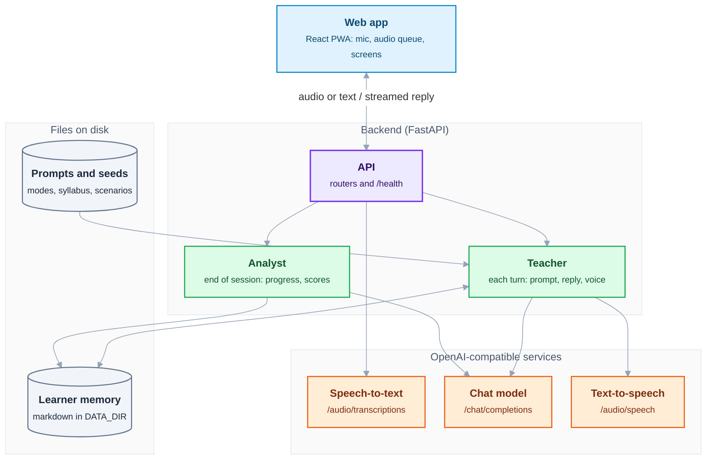
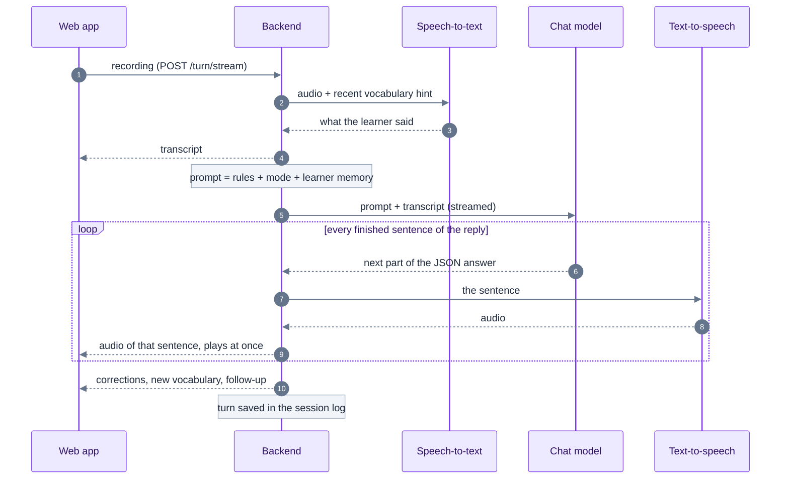

# Architecture

In one sentence: a web page records you, a small server turns your recording into a lesson turn with the help of three AI services, and everything the teacher learns about you is kept in plain text files.

The pieces:

- **Web app** (React, installable on a phone as a PWA): the screens, the microphone and the audio player.
- **Backend** (FastAPI): the **API** receives each request; the **teacher** prepares every turn (instructions, memory, reply, voice); the **analyst** reviews a session when it ends and updates the progress.
- **Files on disk**: the teacher's instructions and teaching content (read only) and the learner memory (written as you practice).
- **Three AI services** with the OpenAI protocol, each configured on its own: local (Ollama, speaches, LM Studio, llama.cpp) or in the cloud (OpenAI, Groq and others).



## A spoken turn

What happens between you finishing a sentence and hearing the teacher:



1. The browser records the learner and posts the audio to `/turn/stream`.
2. The backend sends it to speech-to-text with a short hint (recent vocabulary, proper names from the profile) so rare words are recognised.
3. It builds the system prompt: shared rules (`prompts/shared.md`), the mode prompt (`prompts/<lang>/mode-N-*.md`), an optional block for the mode (a scenario, a text, a syllabus topic) and the learner memory (profile, recent progress, vocabulary, spaced-repetition terms, this week's focus).
4. The chat model answers in a fixed JSON contract: `reply`, `corrections`, `new_vocab`, `suggested_followup`. While it streams, `reply_stream.py` pulls the `reply` text out of the partial JSON and cuts it into sentences, and each sentence goes to text-to-speech at once. The first audio plays before the model has finished.
5. At the end of the stream, `llm_parse.py` parses the full answer (tolerant of broken JSON), drops corrections that quote something the learner did not say, and the turn is appended to the session log.
6. When the session ends, an analyst pass (`post_session.py`) reads only that session's turns, summarises it into `progress.md` (and into the session's notes, which the "My sessions" screen shows), consolidates vocabulary (deduplicated, then scheduled with FSRS spaced repetition), and updates the skill tracker: eight scores on a CEFR spine, active and resolved errors, and a history that draws the progress curve.

## Modes

| Mode | What it does | Needs |
|---|---|---|
| 1 Free talk | Conversation that follows the learner | chat |
| 2 Role-play | A scenario (work or everyday life) with the teacher in character | chat |
| 3 Guided reading | Discuss a text the learner pastes | chat |
| 4 Read aloud and minimal pairs | Per-word feedback on reading; pairs like *Hüte / Hütte* | speech-to-text with word timestamps |
| 5 Writing | Draft an email or chat message, get feedback, send it to a simulated colleague | chat |
| 6 Assessment | Initial level, weekly review, level-up test | chat |
| 7 Expressions | Idioms a native speaker really uses | chat |
| 8 Book | Read a page aloud, then talk about it; remembers the plot | chat, optional vision for page photos |
| 9 Lesson | A topic from the CEFR syllabus, with exercises | chat |

## Backend layout

```
backend/
  app.py            app assembly: CORS, /health, AI error handler, static files
  config.py         every setting, from environment variables
  services/         the three OpenAI-compatible clients + status probing
  routers/          HTTP endpoints (session, turn, progress, books, stories...)
  teacher.py        one teacher turn: prompt, model, TTS, persistence
  post_session.py   end-of-session analyst passes
  prompt_builder.py assembles system prompts from prompts/
  llm_parse.py      tolerant parser of the teacher JSON contract
  reply_stream.py   extracts the reply text from a streaming JSON answer
  memory.py         reads and writes the markdown memory
  srs.py            spaced repetition (FSRS) on top of vocab.md
  syllabus.py       CEFR syllabus and per-learner topic status
  prompts/          teacher prompts, scenarios, syllabus and seeds per language
```

## Graceful degradation

`services/status.py` probes each configured service at startup and on `/health?deep=1`. The web app reads `/health` and adapts:

| Missing | Behaviour |
|---|---|
| Chat model | Setup screen that explains which variables to set |
| Speech-to-text | The microphone is hidden; the learner types |
| Word timestamps | Read-aloud scoring and minimal pairs are disabled |
| Text-to-speech | The browser reads replies with an on-device voice, or text only |
| Vision model | The "photo of a page" option is hidden |

Errors from AI services are typed (`AIServiceError`) and returned as `{detail, service, code}` with HTTP 503 (501 for an unsupported capability), so the app never shows a 500 or invents a reply.

## Learner memory

```
DATA_DIR/
  <learner>/profile.md          name, languages, stt_hints
  <learner>/<lang>/USER.md      goals and level (cefr_estimate)
  <learner>/<lang>/sessions/    one file per day, every turn tagged with its session id
  <learner>/<lang>/sessions/notes/<session>.json  what the end-of-session pass produced
  <learner>/<lang>/progress.md  session summaries
  <learner>/<lang>/vocab.md     vocabulary; srs.json holds its review schedule
  <learner>/<lang>/skill-tracker.md, curriculum.md, syllabus.md, ...
  _shared/scenarios/            your own role-play scenarios (override the built-in ones)
```

Files are the source of truth and can be edited by hand. Session state lives in memory in a single process (one worker), which is enough for a household.
